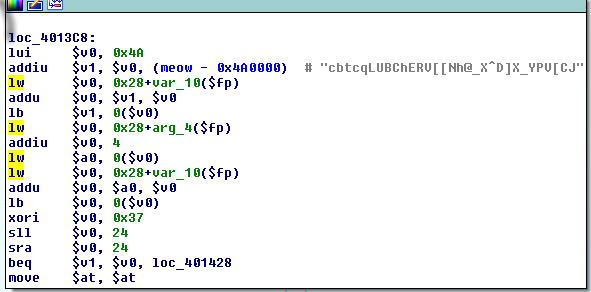

#TUCTF 2016 : RE for 50 plz

##Challenge
[A MIPS 64 bit executable](files/e7453ba07805c6bab5a0b95f57aaeb6e70af76b1) is given
50 points

##Solution
1. Open in IDA Pro

2. The following is a part of the function main

3. After understanding the above section of binary it turns out that it is XOR'ing each of cbtcqLUBChERV[[Nh@_X^D]X_YPV[CJ with 0x37 which gives the Flag : TUCTF{but_really_whoisjohngalt}

4. Profit