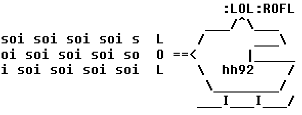
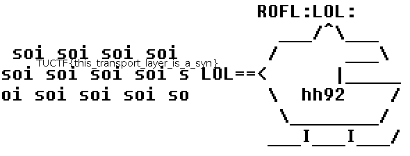

#TUCTF 2016 : The Nack

##Challenge
[A PCAP file](files/ce6e1a612a1da91648306ace0cf7151e6531abc9.pcapng) is given
100 points

##Solution
Opening the pcap in wireshark, you'll immediately notice that all the SYN packets have "GOAT" in their data. The data of the first SYN packet is
>474f41540147494638

which translates to 
>GOAT\x01GIF8

Looks like we have a [GIF](files/gif.mp4) being sent in 4 byte chunks over SYN packets. We can use tshark to extract just the data from the pcap
>tshark -r ce6e1a612a1da91648306ace0cf7151e6531abc9.pcapng -T fields -e data | tr -d '\n' > tempfile.txt

We get [tempfile.txt](files/tempfile.txt) with just the data from all the packets as a hex string. Now we need to remove the 474f415401 (GOAT\x01) prefixing the data in every packet. That can be done quickly using any text editor and the find and replace feature. This leaves us with the contents of the GIF as a hex string ([imagehex.txt](files/imagehex.txt)).

We can use the python interpreter to convert this hex string to a GIF
```python
>>> with open('hexstring.txt', 'r') as myfile:
...     data=myfile.read().replace('\n', '')
...
>>> print data[0:10]
4749463839
>>> import binascii
>>> binstr = binascii.unhexlify(data)
>>> with open('unhex.gif', 'wb') as f:
...     f.write(binstr)
...
>>> exit()
```

This gives us a [ROFLcopter](files/unhex.gif):



. One of the frames has the flag written on it. We used http://ezgif.com/split to split the GIF and get [the frame with the flag](files/frame_16_delay-0.01s.gif):



 The flag is TUCTF{this_transport_layer_is_a_syn}, which is funny because they used the SYN packets to transport the data.